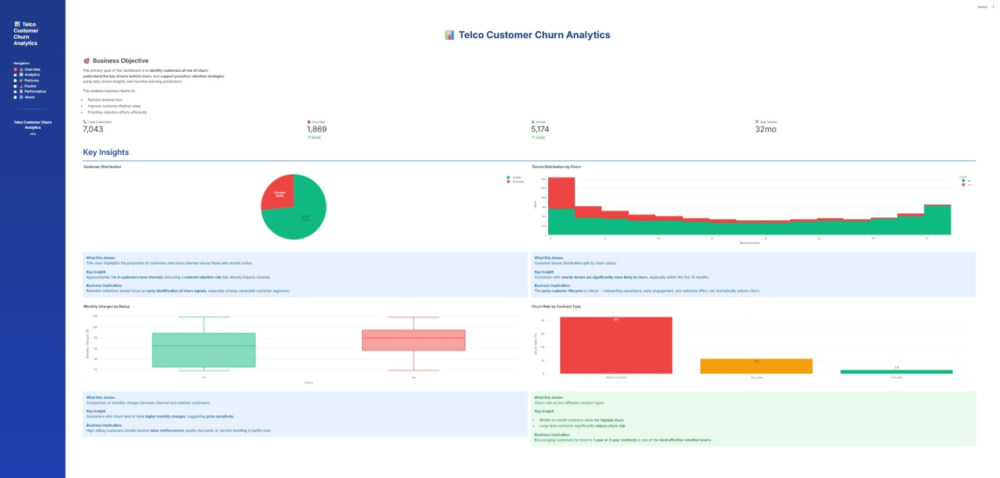
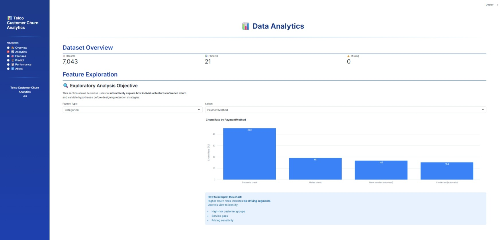
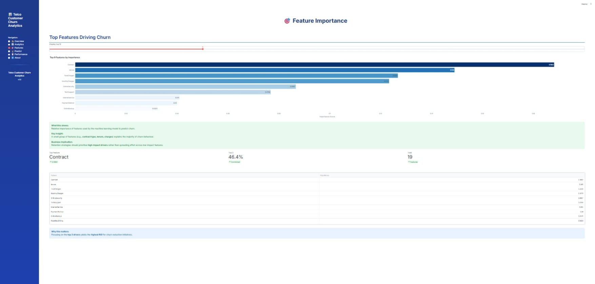
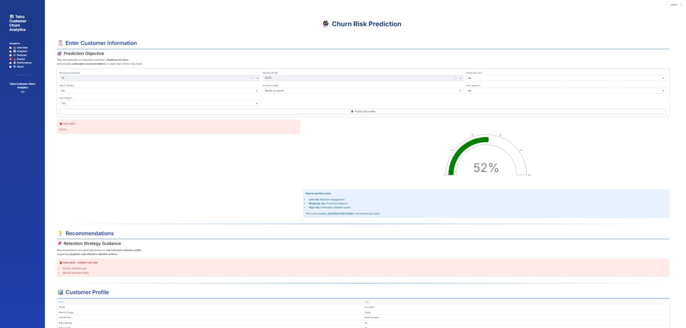
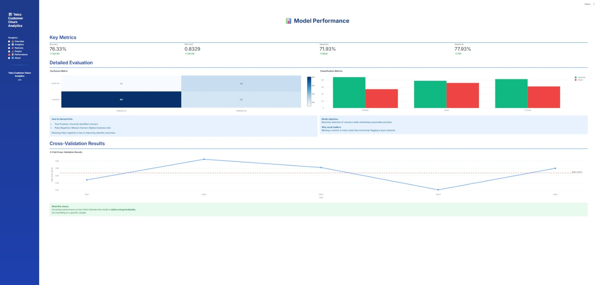
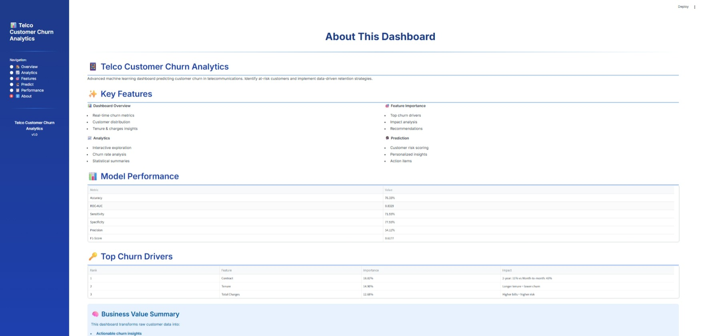

# 📊 Telco Customer Churn Analytics & Prediction Dashboard

## Project Overview

Telco Customer Churn Analytics is a comprehensive data analytics and machine learning project designed to analyse customer behaviour, identify churn drivers, and predict the likelihood of customer churn in the telecommunications industry.

The project combines:

- Exploratory Data Analysis (EDA)
- Machine Learning modelling
- Business storytelling
- An interactive Streamlit dashboard

to transform raw customer data into actionable business insights for decision-makers.

---

## Dataset Content

**Dataset Name:** Telco Customer Churn Dataset  
**Records:** 7,043 customers  
**Features:** 21 variables  
**Target Variable:** Churn (Yes / No)

### Feature Categories

- **Demographics:** Gender, Senior Citizen, Partner, Dependents  
- **Account Information:** Tenure, Contract Type, Payment Method  
- **Services:** Internet Service, Online Security, Tech Support, Streaming Services  
- **Billing:** Monthly Charges, Total Charges  

The dataset is publicly available, anonymised, and suitable for ethical analysis.

---

## Business Requirements

- Identify key factors influencing customer churn  
- Measure churn rate across customer segments  
- Predict churn risk for individual customers  
- Support proactive customer retention strategies  
- Present insights clearly to both technical and non-technical stakeholders  

---

## Hypotheses and Validation

### Hypothesis 1
**Customers on month-to-month contracts are more likely to churn.**

**Validation:**  
Churn rates were calculated and visualised by contract type. Month-to-month customers showed significantly higher churn percentages.

### Hypothesis 2
**Customers with shorter tenure are more likely to churn.**

**Validation:**  
Tenure distributions were analysed and compared across churn groups using histograms and boxplots.

### Hypothesis 3
**Customers with higher monthly charges have a higher churn risk.**

**Validation:**  
Monthly charges were analysed using boxplots and churn rate comparisons.

### Hypothesis 4
**Value-added services (Online Security, Tech Support) reduce churn.**

**Validation:**  
Churn rates were compared between customers with and without these services.

---

## Project Plan

### High-Level Steps

- Data loading and inspection  
- Data cleaning and type corrections  
- Exploratory Data Analysis  
- Feature engineering  
- Machine learning model training  
- Model evaluation  
- Dashboard design and deployment  

### Data Management

- **Collection:** CSV dataset loaded using Pandas  
- **Processing:** Data cleaning, encoding, scaling  
- **Analysis:** Statistical summaries and visual exploration  
- **Interpretation:** Business-focused insights extracted from patterns  

All processing steps were documented and reproducible.

---

## Research Methodology

- EDA-first approach to understand customer behaviour  
- Supervised machine learning for churn prediction  
- Visual storytelling to communicate insights  

This methodology balances interpretability with predictive performance.

---

## Mapping Business Requirements to Visualisations

| Business Requirement | Visualisation |
|---------------------|--------------|
| Measure churn rate | Bar & pie charts |
| Identify churn drivers | Feature importance plot |
| Compare customer segments | Boxplots & histograms |
| Predict churn risk | Gauge chart |
| Evaluate model | Confusion matrix & ROC metrics |

---

## Analysis Techniques Used

- Descriptive statistics  
- Distribution analysis  
- Grouped churn rate calculations  
- Supervised classification (Logistic Regression, Random Forest)  

---

## Limitations

- Dataset is historical and static  
- External factors (competitor pricing, promotions) not included  

---

## Alternative Approaches

- Time-series churn modelling  
- Survival analysis  
- Deep learning models  

---

## Use of Generative AI Tools

Generative AI tools were used to:

- Assist with code optimisation  
- Improve dashboard layout and UX  
- Enhance business storytelling  
- Generate documentation and explanations  

All AI-assisted content was reviewed and customised.

---

## Ethical Considerations

- Dataset is anonymised with no personal identifiers  
- No sensitive attributes used for discriminatory decisions  
- Bias was monitored by comparing churn predictions across groups  
- Ethical and responsible AI principles were followed  

---

## Dashboard Design

### Dashboard Pages

#### Overview

- KPIs  
- Churn distribution  
- High-level insights  

#### Analytics

- Interactive EDA  
- Feature-level churn analysis  

#### Feature Importance

- Top churn drivers  
- Business interpretation  

#### Prediction

- Individual customer churn risk  
- Actionable recommendations  

#### Model Performance

- Accuracy, ROC-AUC  
- Confusion matrix  
- Cross-validation results  

#### About

- Project background  
- Methodology  
- Business value  

---

## Communicating Insights

- **Non-technical users:** KPIs, simple charts, clear labels  
- **Technical users:** Model metrics, feature importance  
- **Executives:** Business impact and recommendations  

---

## Knowledge Gaps & Improvements

- Improved understanding of Streamlit performance optimisation  
- Enhanced ML explainability knowledge (SHAP planned)  
- Peer feedback helped improve dashboard clarity and storytelling  

---

## Development Roadmap

### Challenges Faced

- Feature encoding consistency  
- Model integration into Streamlit  
- Dashboard UX balancing detail vs simplicity  

### Future Enhancements

- SHAP explainability  
- Real-time data ingestion  
- API deployment  
- Cloud hosting  

---

## Deployment

### ⚙️ How to Run the Project

#### 1️⃣ Clone the Repository

git clone https://github.com/swathim251205/telco-churn-analysis-ml.git
cd telco-churn-analysis-ml

2️⃣ Install Dependencies
pip install -r requirements.txt

3️⃣ Run the Streamlit Dashboard
streamlit run dashboard/app.py

## About Project

Dataset: https://www.kaggle.com/datasets/blastchar/telco-customer-churn

Project Type: Data Analytics with Artificial Intelligence – Capstone Project (Code Institute)

Domain: Telecommunications

Focus: Customer Churn Prediction & Business Intelligence

---

## Credits & References

### Code & Libraries

#### Data Analysis & Visualization
* **Pandas**: Data manipulation and analysis - [Documentation](https://pandas.pydata.org/)
* **NumPy**: Numerical computing - [Documentation](https://numpy.org/)
* **Matplotlib**: Statistical plotting - [Documentation](https://matplotlib.org/)
* **Seaborn**: Enhanced data visualizations - [Documentation](https://seaborn.pydata.org/)
* **Plotly**: Interactive visualizations - [Documentation](https://plotly.com/python/)

#### Machine Learning
* **Scikit-learn**: ML algorithms and evaluation metrics - [Documentation](https://scikit-learn.org/)
  * Used for: Logistic Regression, Random Forest, train/test split, StandardScaler, metrics
* **Imbalanced-learn**: SMOTE for handling class imbalance - [Documentation](https://imbalanced-learn.org/)

#### Dashboard & Reporting
* **Streamlit**: Interactive web dashboard framework - [Documentation](https://docs.streamlit.io/)
* **Pandas Profiling (ydata-profiling)**: Automated EDA reports - [Documentation](https://github.com/ydataai/ydata-profiling)

### Learning Resources
* **Code Institute**: Course materials and project structure
* **Scikit-learn User Guide**: Machine learning methodology and best practices
* **Jupyter Notebook Documentation**: Best practices for reproducible analysis
* **StatQuest (Josh Starmer)**: Statistical concepts and ML algorithm explanations

### Methodology
* **CRISP-DM**: Data science project methodology framework
* **Data Ethics & GDPR**: ICO guidance on data protection and privacy

### AI Assistance 
* **GitHub Copilot / Claude AI / ChatGPT**: Used for code suggestions and debugging assistance
  * All AI-generated code was reviewed, tested, and modified to fit project requirements
 
---

## Acknowledgements

* Code Institute tutors and student support team for technical assistance
* The data science community for valuable resources and best practices
* Fellow students for peer support and code reviews

---

# 🌐 Connect with Me 

👩‍💻 **Swathi Mulkundkar** 

🔗 [LinkedIn](https://www.linkedin.com/in/swathimulkundkar/) 

🐙 [GitHub](https://github.com/swathim251205)

⭐ If You Like This Project

Give this repository a ⭐ and feel free to explore or fork it!